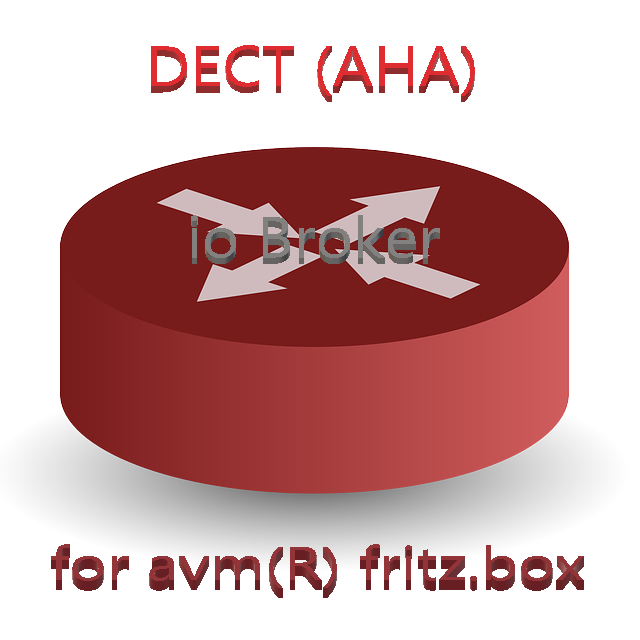

# ioBroker.fritzaha
## Fritzbox DECT (AHA) adapter for ioBroker
### Motivation:
Case Study switching from current - python based - own ioBroker like smarthome engine running on raspbian to ioBroker running on raspbian. 
Current used scanrios
* the heating system via DECT300 (Comet)
* monitoring Servers and Clients with addional usage of different local scripts (like bash, batch, powershell and tasker) and alerting
* monitor drainage pump and alerting
* montor and inform on cloth washer


### Goals:
* learn on GIT deploys and packaging for ioBroker

Forked from [foxthefox/ioBroker.fritzdect]: https://github.com/foxthefox/ioBroker.fritzdect
Additional to the existing functionallity the support of
* (unsafe) HTTPS support
* separation of authorization (diffrent user accounts smarthome, admin etc.)
* focus on AHA (backwards compatibility for non AHA / raw admin page parses )
* separation of polling intervals for different IFs
* adaption of lock settings (ui lock and/or api lock)
* adaption of build in battery low alert (free win - batteries don't die in some minutes ;-))
* retry mechanism for reported failed connects


[](https://travis-ci.org/DDDanny/ioBroker.fritzaha)

## Installation:
actual version from github with 
```javascript
npm install https://github.com/DDDanny/ioBroker.fritzaha/tarball/master --production
```
## Setup

Should be defined in io-package.json or via admin page, before the first start of the instance:
* MUST: Protocoll (bestpratice HTTPS)
* MUST: IP-address (bestpratice fritz.box)
* MUST: Smarthome authorized user and password of Fritzbox for accessing AHA IF (bestpractice separate user and polling @ 120s.
* Optional: setting up admin user for accessing GUEST WLAN IF and Battery Level
* Optional: setting the polling intervals of GUEST WLAN IF and Battery Level 

The devices are detected automatically during startup of fritzdect instance.
the widget requires that also vis-metro and vis-jqui-mfd are installed

## objects

|Object|Value|settable|Description|
|--------|-------|:-:|--------|
|DECT200.state|boolean|x|true/false -> ON/OFF|
|DECT200.mode|boolean|-|not live, for future version|
|DECT200.lock|boolean|-|not live, for future version|
|DECT200.present|boolean|-|true/false -> connected/not available|
|DECT200.temp|value|-|actual temperature in °C|
|DECT200.power|value|-|actual power in W|
|DECT200.energy|value|-|actual energy consumption in Wh|
|DECT200.name|text|-|name of device|
|COMET.temp|value|-|actual temperature in °C|
|COMET.targettemp|value|x|target temperature in °C|
|COMET.comfytemp|value|-|comfort temperature in °C|
|COMET.nighttemp|value|-|night temperature in °C|
|COMET.battery|value|-|actual capacity in %|
|GuestWLAN.state|boolean|x|true/false -> ON/OFF|


## Known Issues:
* (unsafe) HTTPS support
* separation of authorization (diffrent user accounts smarthome, admin etc.)
* focus on AHA (backwards compatibility for non AHA / raw admin page parses )
* separation of polling intervals for different IFs
* adaption of lock settings (ui lock and/or api lock)
* adaption of build in battery low alert (free win - batteries don't die in some minutes ;-))
* retry mechanism for reported failed connects

## TODO:

## Changelog
### 0.0.10
* forked and branded

### 0.0.9
* values '1' accepted for ON
* values '0' accepted for OF

### 0.0.8
* messages info-> debug
* values 1/true/on/ON accepted for ON
* values 0/false/off/OFF accepted for OFF

### 0.0.7
* current temp of Comet/DECT300
* cyclic polling GuestWLAN

### 0.0.6
* correction targettemp in DECT200 section

### 0.0.5
* setTemp on COMET
* GuestWlan corrected

### 0.0.4
* cyclic status polling

### 0.0.3
* user now configurable

### 0.0.2
* metro widget for Dect200
* smartfritz-promise->fritzapi
* running version, tested with 1x DECT200 and Fritzbox FW=6.51 on Win10 with 4.5.0 and raspberry 4.7.0

### 0.0.1
* running version, tested with 1x DECT200 and Fritzbox FW=6.30
